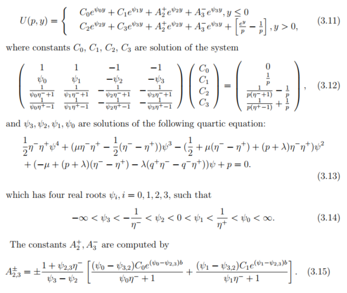

# UNTREF

# Analisis Numerico

## Intento de Resumen de TPs

# Practica 1:

---

### - Procesos estables e inestables

### - funciones recursivas

### arrastran errores de pasos anteriores

### amplifican errores multiplicando las llamadas recursivas

### dificil predecir cuando realizan sumas de numeros de diferente magnitud o numeros parecidos

### - Problemas mal condicionados

### - Evaluar funciones puede ser un problema mal condicionado, por ejemplo 1/sen(x) cerca de uno tiene a infinito.

### - pequeñas variaciones en el input, grandes cambios en el ouput

### - numero de condicion de una funcion. (denota el factor por el cual se amplifica el error)

# Practica 2:

---

### Sistema de ecuaciones / Matrices

### Hallar la matriz inversa es computacionalmente costoso y atrae errores muy grandes.

### numero de condicion de una matriz

### si numero de condicion es >= 1 entonces es mal condicionado

### si A es no inversible -> Ax = b infinitas soluciones - inestable - mal condicionado

### si A es singular, no existe inversa, cond(A) nos dice que tan cerca de ser singular es.

### cambiar filas es costoso => vector/matriz de permutación

---

## Punto 5:

### A medida que achicamos $\epsilon$ aumentan la cantidad de sumas a realizar y disminuye el margen de error al valor que se quiere llegar.

### Vemos tambien que si restamos el valor real - el calculado por la sumatoria, no resulta cierto que al utilizar |xn| < ϵ como condición de corte vamos conseguir un error menor al ϵ dado. Efectivamente, las pruebas avalan.

## Punto 6:

### Vemos entonces que para $S_n$ con $n >= 9$, $f(S_n)$ comienza a arrojar el valor $0$, mientras que $g(S_n)$ continua arrojando valores menos cuestionables.

### Entonces podemos apreciar que la funcion $g(x)$ es la más confiable.

### Esto se debe a que $f(x)$ cuando $x^2 \rightarrow 0 \implies \sqrt{x^2 + 1} \rightarrow 1$ y luego queda una operación de resta entre números muy parecidos, que es algo que hay que evitar ya que genera mucho error. Ya sea para el caso donde $x^2 \rightarrow 0$ o lo que es parecido, cuando $x^2 + 1 \rightarrow 1$

## Punto 8:

### Consideraciones a evitar:

- sumar números de magnitudes diferentes $\implies$ perdida de digitos menos significativos.
- restar numeros parecidos (de la magnitud que sea) $\implies$ perdida de digitos menos significativos.

### Entonces la moraleja es ver que forma de operar los numeros es mejor para evitar en la medida de lo posible estas dos cosas.

### $\qquad$ De lo que se puede apreciar segun los resultados, el punto "a" es el que arroja el menor error, por lo que debería ser el mas confiable. Analizando un poco los ### resultados parciales de cada punto vemos que:

### $\qquad$ El punto a tiene

### - Una resta de numeros muy parecidos

### $\qquad$ El punto b tiene

### - Una suma de numeros muy distantes

### - Dos restas de numeros muy parecidos

### $\qquad$ El punto c tiene

### - Una suma de numeros muy distantes

### - Una resta de numeros muy parecidos

### $\qquad$ El punto d tiene

### - Una suma de numeros muy distantes

### - Una resta de numeros muy parecidos

### $\qquad$ Por lo tiene sentido pensar que el **punto (a)** arrastra menos error, y también coincide con que el **punto (b)** sea la forma con mayor error.

## Ejercicio 9:

### ¿Cuál es más confiable?¿Por qué?

### Como se fue evidenciando a lo largo de los ejercicios, calcular una sucesión de forma recursiva es, salvo casos excepcionales, muy inestable. En general, cada paso recursivo termina arrastrando errores de pasos anteriores. En este caso particular, se evidencian otros dos problemas, primero, se hace más grave ya que tras cada paso, ambos términos de la recursión estan siendo multiplicados por factor mayor a 1, y segundo, tenemos una operación de resta, que a medida que la recursión avanza es más probable que realice restas de numeros parecidos. Por todo lo comentado anteriormente, es mucho más confiable calcular con la fórmula cerrada que con la recursiva.

## Punto 10:

### ¿Es la fórmula recursiva una manera estable de calcular $r_n$ ? Comparar con el ejercicio anterior.

### De manera similar que el ejercicio anterior, podemos establecer que la fórmula recursiva es en general más inestable que la fórmula cerrada.

### Pero, en este caso particular, si observamos los primeros términos, se puede apreciar como, si bien hay un márgen de error, el mismo crece a un ritmo mucho menor que el anterior.

### Por lo que podriamos decir que esta fórmula recursiva es estable en relación a la cerrada ya que no tiene factores en los términos que agrande el error, o también, que al ser una suma no hay problemas de restar numeros parecidos.

### De todas formas, si ampliamos la cantidad de pasos recursivos, vemos como también el error crece. En definitiva, es mucho más estable que el caso del ejercicio anterior, pero aún así sigue siendo menos confiable la fórmula cerrada.

## Punto 11:

### Se puede apreciar en los resultados, que hasta $y_n(16)$ se comporta como una sucesión decreciente como se esperaba. Pero luego, a medida que el miembro $n \cdot y_{n-1}$ se aproxima a $e$, la resta $e - n \cdot y_{n-1}$ comienza a ser una resta entre números cercanos, lo cual ya vimos que acarrea un error muy grande, que además entre cada paso de la recursión, el error de cálculo es amplificado por $n$, lo que vuelve esta operación inviable.

---

# Practica 2:

---

## Ejercicio 7:

### ¿Cómo sería un código si no tenemos una fórmula cerrada? Comparar.

### Si no se puede utilizar la fórmula cerrada, entonces se puede aproximar un valor utilizando la siguiente igualdad:

### $$\vert\vert A \vert\vert_\infty = \max_{\vert\vert x \vert\vert_\infty = 1} \vert\vert A x \vert\vert_\infty $$ siendo $x$ un vector n-dimensional con norma infinito igual a 1.

<table>
<thead>
<tr><td>n</td>	<td>Resultado</td></tr>
</thead>
<tbody>
<tr><td>Cerrada</td>	<td>15</td></tr>
<tr><td>10</td>	<td>13.5314655404</td></tr>
<tr><td>50</td>	<td>12.6244351565</td></tr>
<tr><td>100</td>	<td>13.3797407345</td></tr>
<tr><td>500</td>	<td>14.3088714366</td></tr>
<tr><td>1000</td>	<td>14.6702696714</td></tr>
<tr><td>10000</td>	<td>14.9384490185</td></tr>
<tr><td>100000</td>	<td>14.9694537385</td></tr>
</tbody>
</table>

### Cómo podemos observar, a medida que incrementamos la cantidad de vectores con los que probamos, la aproximación mejora.

## Ejercicio 11:

### Sin comentarios

## Ejercicio 14:

### Sin comentarios

## Ejercicio 15:

### Sin comentarios

## Ejercicio 16:

### Se evidencia convergencia

---

# Practica 3

---

## Ejercicio 1:

- Biseccion

### dado un intervalo $[a,b]$ utiliza un punto intermedio entre los extremos, denominado $x_o$, si la multiplicacion de $f(a)*f(x_0) = 0$ entonces se encontró una raiz. Si es mayor, se pone a $x_0$ como extremo inferior y si es menor se pone a $x_0$ como extremo superior y retorna el nuevo intervalo.

- Newton raphson

### Dado un intervalo $[a,b]$ se calcula $x_0 - f(x_0)/fx(x_0)$

### utiliza un punto intermedio entre los extremos (x_0) y lo aplica a la funcion dividido su derivada.

## Ejercicio 2

### Para bajas tolerancias el resultado es incorrecto porque el problema no es numerico no porque este mal implementado. Recien comienza a tener una curva mas suave para tolerancias de $e^{(-8)}$

### ¿Por que para tolerancias bajas da mal?

#### La tolerancia implica que precisión le pedimos al método para encontrar las raices, cuanto mayor es la tolerancia, menos precisión.

### ¿Que cálculos amplifican errores?

#### La matriz es grande, segun pruebas, el numero de condicion ronda entre $10^1$ y $10^2$ lo que aproximadamente se traslada en un error entre 1 y 2 digitos decimales.

#### La antitransformada usa coeficientes que van creciendo mucho. Multiplicando a la función U.

#### En la mayoría de las situaciones, al tener una tolerancia alta, los métodos tienen más posibilidades de acercarse a una raíz aproximada en menor tiempo pero esto puede llevar a tener un error más alto.En cambio, cuando la tolerancia comienza a superar el orden de los seis dígitos, todos los métodos presentan demoras en la obtención de los datos ya que requiere más precisión, lo que disminuye el error.

#### El root finding es brentq ya que combina el método de bisección con el método de la Newton-Raphson junto con el método cuadrático inverso.La idea es que se comienza con un cambio de signo en el intervalo, del cual no se sale. Si la iteración resulta bastante bien, se toma el último método mencionado. En el caso de que se esté en el paso de Newton-Raphson o cuadrático inverso y no mejora, se toma el paso de bisección. Este tipo de programa aplica el concepto de adaptatividad, lo que significa que se adapta y ajusta según la experiencia previa del problema.

## Ejercicio 3

### . Los coeficientes son muy grandes por eso amplifican los errores $(A_j)$ entonces en la anti transformada puede amplificar el error. Igual que p y las constantes C

### . Tambien depende mucho de los valores que tengan las variables X (depende de s), A (depende del strike) e Y (depende de A y X)

### . De la cantidad de dias que se toman ya que varia la amplitud de la curva.

### . Las tolerancias afectan a las raices. cuanto mas grande es la tolerancia, la raiz es mas lejana del valor real. Si la tolerancia es baja, la curva que se obtiene se aproxima mas a la real.

### . A traves del Condicional(A) se verifican pérdidas de entre 1 o 2 decimales de precisión, que quizas para el calculo del precio de stock quizas no sea significativo, pero para el calculo de probabilidades si.

## Ejercicio 4

### Se separan las muestras en 5 partes (4 para el training data y uno para el test data)

### Transformamos la entrada en polinómica segun el grado que definamos (1 a 5) e instruimos a la regresión lineal que aprenda de los datos (ahora polinómicos) (X transformado en polinomica,y)

### Se obtienen los MSE y desviacion standard de cada set correspondientes al training data

### El grado que tenga el menor mse es el modelo mas confiable.

### De la evaluación del MSE y DESV STD no se registra que haya una mejora sustancial entre los distintos grados.

---

# Practica 4

---

### Los métodos de Runge-Kutta son un conjunto de métodos genéricos iterativos

### Un spline cúbico es una interpolacion por polinomios a trozos de grado 3. Se busca una funcion S tal que sus tres derivadas consecutivas sean continuas en un intervalo.

## Punto 1 y 3:

### Resolución númerica: No construye una formula para f si no una tabla de valores $Xi = x(ti)$ aproxiumados

### Cuando obtengo todos los $x_i$ se "contruye" $x(t)$ interpolando con splines cubicos (CubicSpline)

### Se grafican S y sus derivadas para demostrar la existencia de las mismas.

## Punto 4: Burden 554

### Si a la formula de u se le aplica t = 0 entonces se obtiene la formula G que en este caso es $sin(\pi x)$ en los otros casos la formula $u$ es $e^{(\pi t)} \cdot sin(\pi x)$
